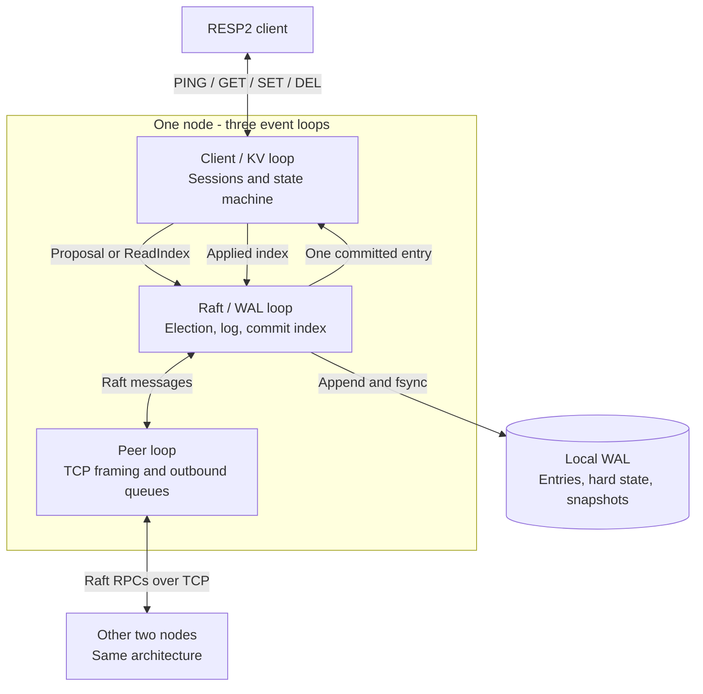

# Raft KV

A C++20 replicated key-value store that keeps one ordered history across three
processes. It combines Raft consensus, durable writes, quorum-confirmed reads,
and crash recovery behind a small RESP2 interface.

The project focuses on the boundaries between **replication, persistence, and
state-machine application**: when an operation can return success, what survives
a restart, and what happens when a majority is unavailable.

[Architecture](docs/architecture.md) · [Design decisions](docs/design-decisions.md) ·
[Demo](docs/demo.md) · [Validation](VALIDATION.md) · [Code map](docs/README.md)

## Architecture

Each node has three single-owner Boost.Asio event loops. The Raft loop owns
consensus and the write-ahead log (WAL); the client loop owns the key-value state;
the peer loop owns inter-node TCP connections. Cross-loop work is posted as messages.



A write returns success after durable majority replication and local application.
A `GET` completes a ReadIndex round and waits for the local state machine to reach
the safe index. `PING` is a local health check and does not establish quorum health.

See the [write/read sequences and recovery path](docs/architecture.md) for the
ordering rules behind these statements.

## What it implements

| Area | Mechanism |
| --- | --- |
| Consensus | Randomized elections, PreVote, one vote per term, conflict repair, and current-term quorum commit. |
| Application | One committed entry in flight; the KV loop acknowledges its applied index before the next entry is dispatched. |
| Reads | Leader-only ReadIndex with round identifiers, current-term confirmation, and an applied-index barrier. |
| Persistence | CRC-checked WAL records, flush-before-ack ordering, damaged-tail repair, and validation of recovered committed state. |
| Recovery | Whole-state snapshots, in-memory log compaction, InstallSnapshot catch-up, and committed-suffix replay. |
| Client and peer I/O | Incremental RESP2 decoding, ordered replies per session, framed MessagePack peer messages, and bounded peer queues. |

The runtime uses exactly one Raft group with static member IDs `{1,2,3}`. Two
communicating, healthy nodes can make progress; a lone node cannot successfully
complete a new quorum-backed operation.

## Build and verify

Requires CMake 3.20+, a C++20 compiler, Boost.System, msgpack-cxx, GoogleTest,
Bash, and Python 3. Linux is exercised by [GitHub Actions](https://github.com/kelvinlee200113/raft-kv-store/actions/workflows/ci.yml);
local validation also runs on macOS.

Ubuntu dependencies:

```sh
sudo apt-get install build-essential cmake libboost-dev libboost-system-dev libmsgpack-cxx-dev libgtest-dev python3
```

From the repository root:

```sh
cmake -S . -B build -DCMAKE_BUILD_TYPE=Release
cmake --build build --parallel
ctest --test-dir build --output-on-failure --timeout 60 --no-tests=error
./scripts/validate_cluster.sh
```

The last command starts three local processes in temporary directories, writes
and reads data, kills the elected leader, verifies failover, restarts the cluster,
and checks that reads and writes fail safely without a majority. It cleans up its
own processes and data on exit. Use `KEEP_VALIDATION_DATA=1` to retain the evidence.

For a hands-on walkthrough, use the [three-terminal demo](docs/demo.md). For
sanitizers, coverage, dated results, and test limitations, see [Validation](VALIDATION.md).

## Technical decisions and tradeoffs

| Decision | Benefit | Cost / boundary |
| --- | --- | --- |
| Three event loops with separate owners | Consensus, sockets, and KV mutations have explicit ownership. | Cross-loop handoffs add scheduling overhead; snapshot installation can block the Raft loop. |
| Synchronous WAL flushes | Persistence ordering is visible before acknowledgements and successful completion. | Disk stalls delay heartbeats and consensus processing. |
| Single-flight committed apply | Preserves order and avoids a separate unbounded queue of copied apply work. | Limits apply parallelism; the Raft log and pending requests can still grow. |
| ReadIndex instead of read leases | Establishes read authority through a quorum round without a clock-based lease. | Requires quorum communication; followers reject reads. |
| Whole-state snapshots | Simple state capture and lagging-follower catch-up. | Copies the whole KV state, does not reclaim WAL bytes, and must fit one WAL record. |
| Fixed three-node membership | Keeps election, recovery, and failure behavior small enough to inspect. | No membership changes, sharding, or horizontal partitioning. |

[Design decisions](docs/design-decisions.md) explains the alternatives, source
locations, and conditions that would justify revisiting each choice.

## Command semantics

| Command | Success | Failure behavior |
| --- | --- | --- |
| `PING [message]` | `PONG` or supplied message | Local only; may succeed without a leader. |
| `SET key value` | `OK` after commit and apply | Followers return `NOT_LEADER`; a timeout has an unknown write outcome. |
| `GET key` | Value or `(nil)` after ReadIndex | Followers return `NOT_LEADER`; no read quorum returns `TRYAGAIN`. |
| `DEL key [key ...]` | Number of deleted keys after commit and apply | Same quorum and timeout rules as `SET`. |

`TRYAGAIN write outcome unknown` does **not** mean the write was rolled back. The
entry may commit later. Request IDs correlate local replies; there is no durable
client-request deduplication or exactly-once retry contract.

## Scope and limits

This is a focused systems project with reproducible correctness checks. It does
not implement dynamic membership, multi-Raft, transactions, expiration, follower
reads, authentication, TLS, or full Redis compatibility. There are no measured
throughput or latency claims.

RESP bulk strings are limited to 1 MiB, peer payloads to 64 MiB, and individual
WAL payloads to less than 16 MiB. In this revision an oversized whole-state
snapshot can stop the node; use small datasets for the demo. Frame limits do not
bound total database size or total process memory. See the
[storage and capacity boundaries](docs/architecture.md#storage-and-capacity-boundaries).

## License and acknowledgements

MIT licensed.
