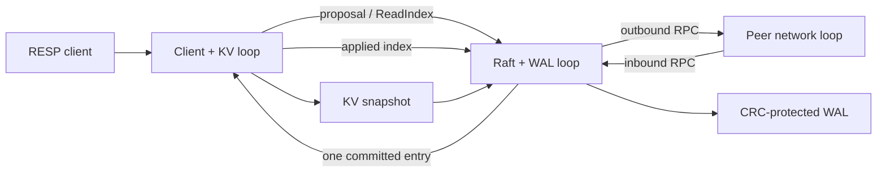
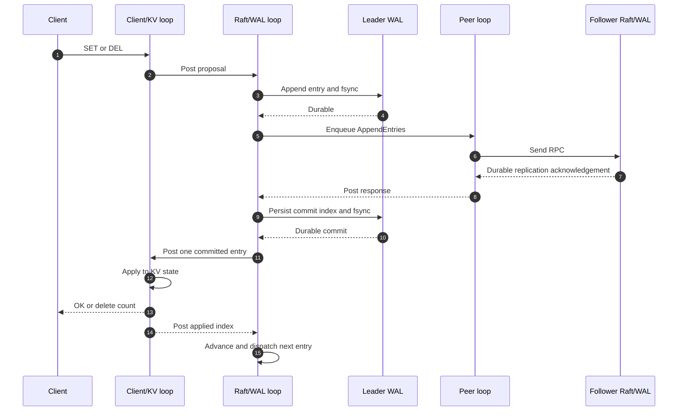

# Raft KV

Raft KV is a C++20 replicated key-value store built around one fixed three-node Raft group. It exposes `PING`, `GET`, `SET`, and `DEL` through RESP2 over Boost.Asio.

The project is intentionally scoped to member IDs `{1,2,3}`, static membership, and one Raft group. It is not a Redis-compatible production service.

## Core guarantees

- Randomized leader election with PreVote and one vote per term.
- Current-term quorum commit with ordered state-machine application.
- Leader-only linearizable reads through quorum-confirmed ReadIndex rounds.
- CRC-checked WAL recovery with damaged-tail truncation and startup failure when repair fails or recovered commit metadata cannot be satisfied.
- Whole-state snapshots, InstallSnapshot catch-up, and in-memory log compaction.
- Consensus-backed operations return success only after two-node quorum confirmation.

## Architecture and invariants

Each node runs three single-owner Boost.Asio event loops:

| Event loop | Owns |
| --- | --- |
| Raft | Consensus state, timers, and WAL access |
| Peer | Raft TCP listeners, connections, and outbound queues |
| Client/KV | RESP sessions, pending requests, and the key-value state machine |

Committed entries cross from Raft to KV one at a time. The KV loop posts the applied index back before Raft dispatches the next entry; unapplied work remains in the Raft log.



The ownership model avoids a global application mutex. Writes reply only after application, and reads wait until the local state machine reaches the ReadIndex safe index.

### Committed write sequence



## Build and test

Requirements:

- CMake 3.20 or newer and a C++20 compiler
- Boost headers and Boost.System
- msgpack-cxx and GoogleTest
- Python 3 for the client and process workflow

Ubuntu dependency example (verify `cmake --version` reports 3.20 or newer):

```bash
sudo apt-get install build-essential cmake libboost-dev libboost-system-dev libmsgpack-cxx-dev libgtest-dev python3
```

Build and run the test suite:

```bash
cmake -S . -B build -DCMAKE_BUILD_TYPE=Release
cmake --build build --parallel
ctest --test-dir build --output-on-failure --no-tests=error
```

See [`VALIDATION.md`](VALIDATION.md) for sanitizer and source-coverage commands and the latest local verification receipt.

## End-to-end validation

Run the three-process workflow after building:

```bash
./scripts/validate_cluster.sh
```

The workflow uses isolated temporary data directories and dynamically selected localhost ports. It verifies:

1. election and leader-only command routing;
2. concurrent committed writes and ReadIndex-backed reads;
3. elected-leader crash, two-node failover, and continued progress;
4. WAL and snapshot recovery across full-cluster restarts;
5. durable deletion and safe failure without a majority.

Temporary files are removed on exit. Set `KEEP_VALIDATION_DATA=1` to retain node logs and storage, or set `RAFT_KV_BIN=/path/to/raft-kv` to validate another build.

## Commands

| Command | Behavior | Reply |
| --- | --- | --- |
| `PING [message]` | Local health check | `PONG` or the supplied message |
| `SET key value` | Persist, replicate, commit, and apply | `OK` |
| `GET key` | Complete ReadIndex and wait for local application | value or `(nil)` |
| `DEL key [key ...]` | Persist, replicate, commit, and apply | number of deleted keys |

Followers reject `GET`, `SET`, and `DEL` with `NOT_LEADER <id>` or `NOT_LEADER UNKNOWN`. A read quorum timeout returns `TRYAGAIN read quorum unavailable`.

A timed-out `SET` or `DEL` returns `TRYAGAIN write outcome unknown` because the entry may commit after the client times out.

## Implementation and test map

CI builds a Release configuration on Linux, runs all 11 CTest targets, and executes the three-process validation workflow.

| Property | Implementation | Verification |
| --- | --- | --- |
| Election, PreVote, and quorum commit | `src/raft/` | `tests/voting_test.cpp`, `tests/replication_test.cpp` |
| Ordered single-flight application | `src/raft/raft.cpp`, `src/app/node_runtime.cpp` | `tests/async_apply_test.cpp`, `scripts/validate_cluster.sh` |
| Linearizable leader reads | `src/raft/raft.cpp`, `src/app/node_runtime.cpp` | `tests/read_index_test.cpp` |
| RESP2 protocol and sessions | `src/server/` | `tests/resp_codec_test.cpp`, `tests/resp_server_test.cpp` |
| Peer transport and bounds | `src/transport/` | `tests/network_test.cpp`, `tests/transport_proto_test.cpp` |
| WAL recovery | `src/wal/` | `tests/wal_test.cpp` |
| Snapshots and compaction | `src/raft/`, `src/wal/`, `src/server/kv_store.cpp` | `tests/snapshot_test.cpp`, `scripts/validate_cluster.sh` |

## Run a cluster manually

Start each node in a separate terminal. The examples use numeric IPv4 addresses.

```bash
mkdir -p /tmp/raft-kv/node{1,2,3}

./build/raft-kv --id=1 --raft=127.0.0.1:9101 --client=127.0.0.1:9201 \
  --peer=2@127.0.0.1:9102 --peer=3@127.0.0.1:9103 --data=/tmp/raft-kv/node1

./build/raft-kv --id=2 --raft=127.0.0.1:9102 --client=127.0.0.1:9202 \
  --peer=1@127.0.0.1:9101 --peer=3@127.0.0.1:9103 --data=/tmp/raft-kv/node2

./build/raft-kv --id=3 --raft=127.0.0.1:9103 --client=127.0.0.1:9203 \
  --peer=1@127.0.0.1:9101 --peer=2@127.0.0.1:9102 --data=/tmp/raft-kv/node3
```

Use the included RESP client against the elected leader. Replace port `9201` if another node wins the election.

```bash
python3 scripts/resp_client.py --port 9201 PING
python3 scripts/resp_client.py --port 9201 SET instrument ES
python3 scripts/resp_client.py --port 9201 GET instrument
python3 scripts/resp_client.py --port 9201 DEL instrument
```

## Scope and tradeoffs

- Exactly three static members in one Raft group.
- No joint consensus, dynamic membership, sharding, or multi-Raft.
- Leader-only reads; no follower or lease reads.
- Synchronous WAL flushes can stall the Raft event loop.
- Whole-state snapshots without chunked streaming or WAL byte reclamation.
- RESP bulk strings capped at 1 MiB, peer payloads at 64 MiB, and WAL record payloads below 16 MiB.
- No transactions, expiration, pub/sub, authentication, TLS, or full Redis compatibility.
- No durable request deduplication; retries can have an ambiguous outcome.
- No performance claims without a documented, reproducible benchmark.

## Acknowledgements

Early repository history adapted portions of the transport and write-ahead-log foundations from [`jinyyu/raft-kv`](https://github.com/jinyyu/raft-kv), distributed under the MIT License. The current project substantially redesigns and extends that foundation. See [`THIRD_PARTY_NOTICES.md`](THIRD_PARTY_NOTICES.md) for the retained upstream notice.

## License

This project is distributed under the MIT License. See [`LICENSE`](LICENSE) and [`THIRD_PARTY_NOTICES.md`](THIRD_PARTY_NOTICES.md).
