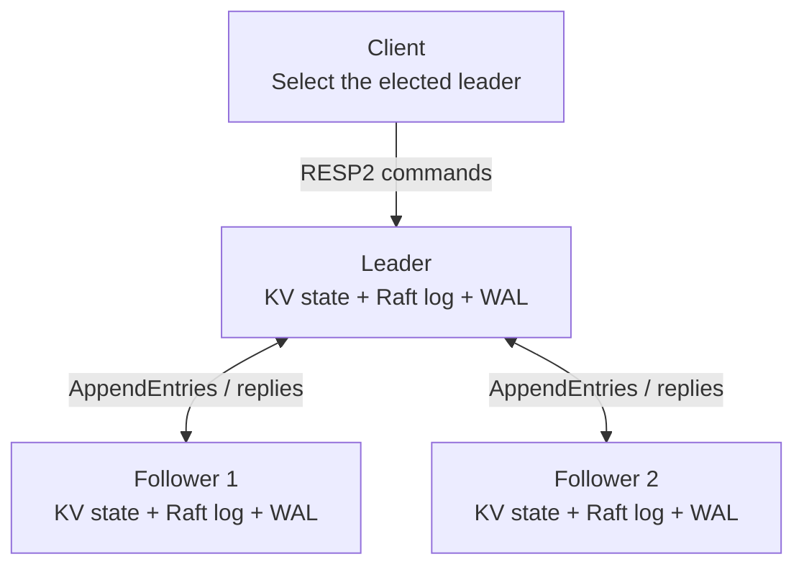
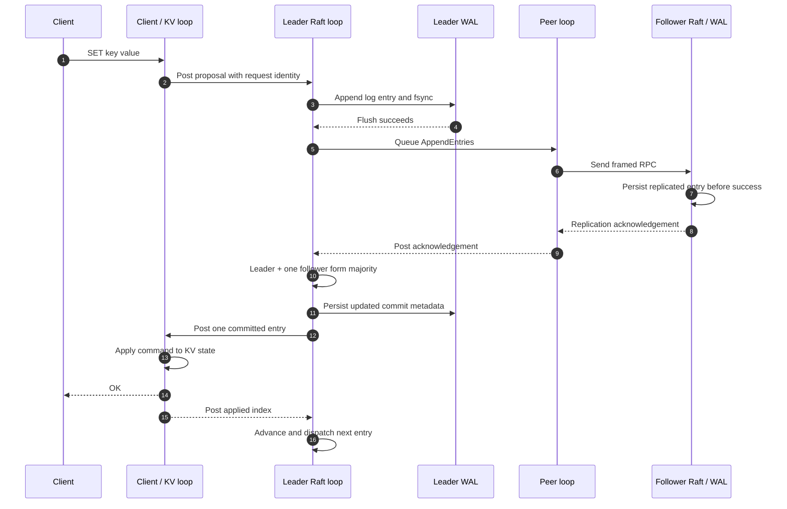
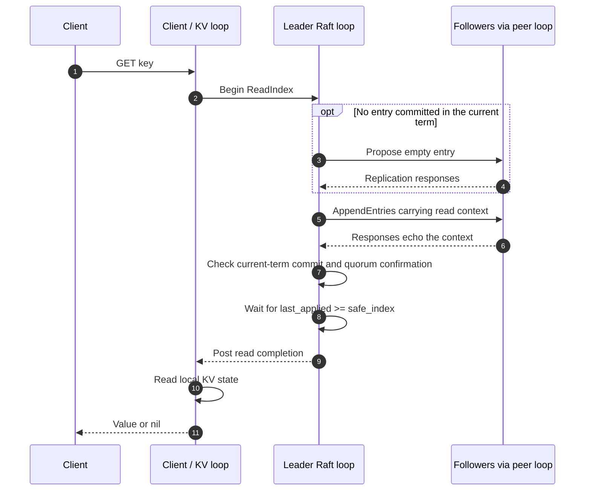
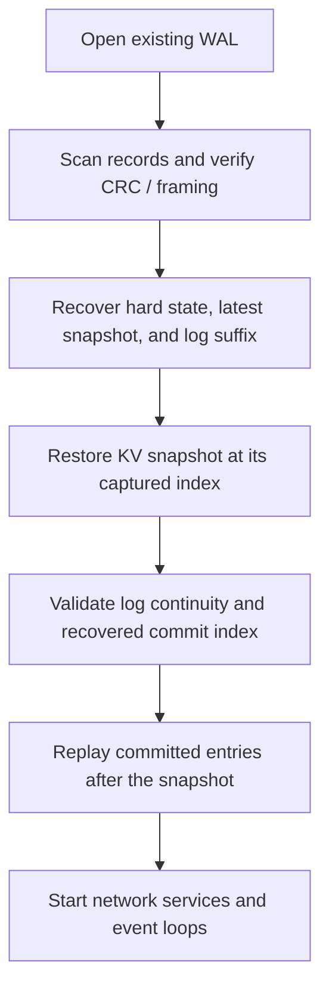

# Architecture

[Overview](../README.md) · [Decisions](design-decisions.md) · [Demo](demo.md) ·
[Validation](../VALIDATION.md)

Raft KV runs one static three-node consensus group. Every process contains the
same consensus, transport, storage, and client-serving components. Leadership
changes the role of a process; it does not change its thread layout.

## Cluster topology

This diagram shows replication in a stable term. During elections nodes exchange
PreVote and RequestVote messages; a lagging follower may receive InstallSnapshot.
Clients can connect to any member, but followers reject `GET`, `SET`, and `DEL`
with `NOT_LEADER <id>` or `NOT_LEADER UNKNOWN`. Requests are not forwarded.

## Thread ownership

Each `io_context` runs on one thread. Mutable application state stays with its
owner, and `boost::asio::post` transfers work across loop boundaries.

| Owner | State and work |
| --- | --- |
| Raft loop | Term, vote, leader role, log, replication progress, commit/applied indexes, timers, WAL, and in-flight apply/read coordination. |
| Peer loop | Peer TCP listener, inbound framing, outbound connections, reconnects, and send queues. |
| Client/KV loop | RESP sessions, pending client replies, the KV map, state-machine application, and snapshot serialization/deserialization. |

The design avoids a global mutex around the application state. It is not a
lock-free-runtime claim: Asio scheduling, allocation, synchronous file I/O, and
snapshot coordination still have costs. `restore_snapshot` posts work to the KV
loop and waits on a future for up to five seconds.

Source: [`NodeRuntime::Impl`](../src/app/node_runtime.cpp).

## A write: durable, committed, then applied

These are different milestones:

- **Durable:** a node has flushed the record through `fwrite`, `fflush`, and `fsync`.
- **Committed:** the leader has established the required majority replication;
  advancing by replica counts requires an entry from the current term.
- **Applied:** the local KV state machine has executed the committed command.

The second follower need not acknowledge before client success. Committed entries
are dispatched strictly in index order, with only one entry awaiting its apply
acknowledgement. A slow KV loop therefore leaves the backlog in the Raft log.
This bounds the apply handoff, not the log or total client backlog.

A response is correlated by the command's origin node and request ID. The node's
five-second request deadline may expire while replication is still possible.
`TRYAGAIN write outcome unknown` preserves that ambiguity; a later commit is
allowed. There is no durable retry-deduplication table.

Sources: [`Raft::propose`, `handle_append_entries_response`](../src/raft/raft.cpp),
[`dispatch_next_committed_entry`, `acknowledge_applied`](../src/app/node_runtime.cpp),
[`WAL::sync`](../src/wal/wal.cpp).

## A read: authority plus an applied-index barrier

Reading the leader's local map alone does not establish that it still has quorum
authority. A ReadIndex token pairs a unique round context with a safe log index.

The diagram separates the logical gates; an AppendEntries exchange can perform
both replication and read confirmation. Requests can share an in-flight round.
Responses from stale rounds or nonmembers cannot supply its quorum, and leadership
loss invalidates the pending round. When no quorum can confirm the read, the
request times out with `TRYAGAIN read quorum unavailable`.

Sources: [`read_index`, `read_index_ready`, `finish_read_index`](../src/raft/raft.cpp),
[`poll_read_indexes`](../src/app/node_runtime.cpp),
[`read_index_test.cpp`](../tests/read_index_test.cpp).

## Recovery and snapshots

The WAL stores MessagePack-encoded entries, hard state (term, vote, commit index),
and snapshots. Each record has an eight-byte header containing type, a three-byte
payload length, and a CRC32 checksum of the payload.

A damaged tail is truncated before future appends. Repair failure or missing data
required by the recovered commit index causes startup to fail. Recovery validation
is essential: a parsable prefix is not enough if it cannot reconstruct committed
state.

For a local snapshot, the KV loop captures its current applied index and serialized
state together. The Raft loop persists that snapshot before removing the covered
in-memory log prefix. Compaction uses the **captured index**, which may lag the
Raft loop's current applied index.

When a follower's next index lies behind the compacted prefix, the leader sends
InstallSnapshot. The follower restores the state machine, persists the snapshot
and hard state, then acknowledges success. Snapshot installation rejects stale
state that would roll back a newer committed/applied position. The persistence
record also records whether recovery must discard the old local suffix.

Snapshots live inside the WAL. Recovery still scans WAL records; snapshots reduce
state-machine replay and allow replication catch-up, but old WAL bytes are not
reclaimed and no bounded startup-time claim follows.

Sources: [`recover_storage`, `maybe_capture_snapshot`, `restore_snapshot`](../src/app/node_runtime.cpp),
[`take_snapshot`, `handle_install_snapshot`](../src/raft/raft.cpp),
[`WAL::recover`](../src/wal/wal.cpp).

## Storage and capacity boundaries

| Boundary | Current value / behavior |
| --- | --- |
| RESP argument | At most 1 MiB per bulk string; arrays contain at most 1,024 elements. |
| RESP decoder buffer | At most 2 MiB of buffered input. |
| Peer frame | Five-byte header: type plus a big-endian 32-bit length; payload at most 64 MiB. |
| WAL record | Eight-byte header; encoded payload at most `2^24 - 1` bytes, including MessagePack overhead. |
| Snapshot | Entire encoded KV state must fit one WAL record; no chunked transfer or disk reclamation. |
| Snapshot trigger | Default threshold is 100 applied entries; `--snapshot-threshold=0` disables capture. |
| Client deadline | Five seconds; write timeout leaves the outcome unknown. |

In this revision, exceeding the snapshot WAL-record limit throws out of snapshot
capture/installation and can stop the node. A small per-command limit does not
prevent a large aggregate database. The demo uses small values and datasets.
Disabling snapshots avoids that capture path but allows retained logs to grow;
it does not provide a scalable storage policy.

Peer frame limits also do not imply bounded replication batches: the core can
assemble a follower's entire missing suffix for one AppendEntries message. A
large backlog needs explicit batching before claiming scalable catch-up.

Sources: [`RespLimits`](../src/server/resp_codec.h),
[peer framing](../src/transport/proto.h), [WAL encoding](../src/wal/wal.cpp),
[`broadcast_heartbeat`](../src/raft/raft.cpp).
